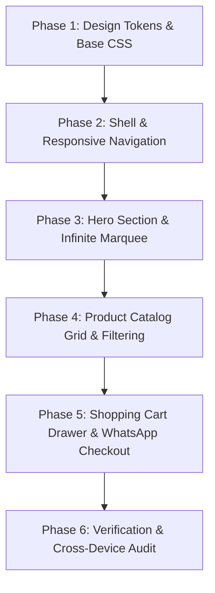

# Process & Architecture Workflow - Santhi Ganesh Bakery Website

This document details the engineering methodology, copywriting direction, architecture, and step-by-step implementation process to build the website for **Santhi Ganesh Bakery, Tirunelveli** matching the Figma designs (`Home Desktop` & `Home Mobile`).

---

## 1. Project Objective & Vision
To build a stunning, premium, fully-responsive web application for **Santhi Ganesh Bakery in Tirunelveli** that converts visitors into cake buyers. The site bridges high-end editorial bakery design (warm cream tones, elegant Aboreto/Lora typography) with local Tirunelveli warmth and seamless cake ordering.

---

## 2. Technical Stack & Architecture

- **Core Framework:** HTML5, Modern Vanilla JavaScript (ESNext), and CSS3 with CSS Custom Properties (Variables).
- **Styling Method:** Vanilla CSS with structured design tokens in `index.css` (No Tailwind required, strictly adhering to custom design tokens).
- **Typography:** Google Fonts (`Aboreto` display font + `Lora` body serif font).
- **Icons & Visuals:** SVG icons (Shopping cart, chevrons, stars, close button) and high-resolution cake imagery from the local folder.
- **Interactivity:**
  - Responsive Mobile Navigation drawer & dropdown menus.
  - Infinite auto-scrolling hero marquee rows for desktop and mobile.
  - Category filtering tabs for cake catalog.
  - Interactive Shopping Cart drawer with local storage persistence.
  - One-click WhatsApp Direct Ordering with pre-filled cake details.

---

## 3. Copywriting Strategy (Tirunelveli Heritage Focus)

Rather than generic lorem ipsum text, the content is crafted specifically for Santhi Ganesh Bakery:
- **Hero Title:** *"The Black Forest That Stops Conversations."*
- **Hero Subtitle:** *"Crafted fresh every morning in Tirunelveli. From rich velvet birthday tiers to delicate buttercream pastries, every bite is a celebration."*
- **Value Props:**
  1. 🌿 **Fresh Daily Ingredients:** Made with pure butter, rich cocoa, and fresh fruits daily.
  2. 🚚 **Tirunelveli Doorstep Delivery:** Express delivery across Tirunelveli city & surrounding areas.
  3. 🎨 **Custom Cake Design:** Custom 2-tier and 3-tier designs for weddings, baby showers, and birthdays.
  4. 🥚 **Egg & Eggless Options:** 100% pure vegetarian / eggless options available for all flavors.

---

## 4. Phase-by-Phase Execution Plan

### Phase 1: Foundation & CSS Design System (`index.css`)
- Define CSS custom properties for all Figma tokens (`--color-bg-primary`, `--color-accent-desert`, font families, radii, breakpoint media queries).
- Normalize styles, custom scrollbar styling, and smooth animations.

### Phase 2: Navigation & Header Shell (`index.html` + `app.js`)
- Implement desktop navbar with logo, nav links (`Home`, `About Us`, `Cakes`, `Custom Cakes`, `Contact`), cart badge button, and "Order" CTA button.
- Build mobile slide-out drawer navigation for seamless phone experience.

### Phase 3: Hero Section & Photo Marquee
- Implement editorial Aboreto header and call-to-action buttons.
- Build dual-row photo strip marquee with smooth CSS keyframe animations showing real cake photos from `Birthday cakes for her`, `Engagement, wedding cakes`, etc.

### Phase 4: Product Catalog Grid & Filters
- Build responsive 4-column (desktop) / 2-column (mobile) product grid.
- Implement filter buttons for categories (`All`, `Birthday Cakes`, `Wedding & Engagement`, `Baby Shower`, `Theme Cakes`).
- Show prices in `₹` INR with quantity/weight tags (`1kg`, `500g`, `2kg`).

### Phase 5: Cart Drawer & Direct WhatsApp Order
- Floating slide-over cart drawer showing added cakes, item quantity adjusters, subtotal calculation, and "Order via WhatsApp" button.

### Phase 6: Automated Build & Visual Verification
- Verify responsiveness on desktop and mobile viewports.
- Ensure 100% pixel fidelity with the Figma specifications.
